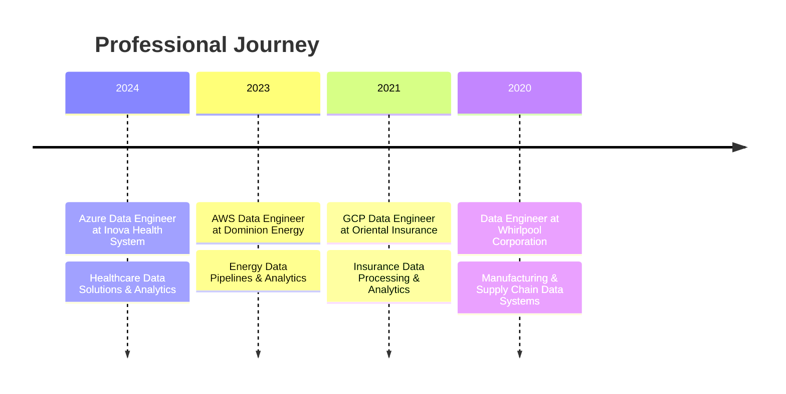

<!-- Profile Header with Animated Banner -->
<div align="center">
  
</div>

<h1 align="center">Data Analytics Engineer & AI Specialist</h1>

<p align="center">
  
  <a href="https://www.linkedin.com/in/vishalorsu/"></a>
  <a href="mailto:vishalorsu@gmail.com"></a>
  <a href="https://github.com/vishalorsu"></a>
</p>

<p align="center">
  <b>MSc in Data Analytics Engineering | Certified Data Engineer | Machine Learning & AI Expert</b>
</p>

<p align="center">
  
</p>

<div align="center">
  
</div>

---

## 💼 Professional Experience

<details open>
<summary><b>✨ Experience Highlights</b></summary>
<br>

<!-- Experience Timeline -->
<div align="center">

</div>

### 🚀 Azure Data Engineer
**Inova Health System | Virginia, USA | May 2024 - Present**
- Design and implement data architectures using **Azure Data Lake, Azure SQL Database, and Azure Synapse Analytics** for healthcare data storage and analytics
- Develop automated data pipelines with **Azure Data Factory** for streamlined ETL of healthcare data across systems
- Implement CI/CD pipelines using **Azure DevOps** for continuous deployment and testing in a regulated healthcare environment
- Write and optimize complex **SQL queries** for clinical, operational, and financial reporting
- Create data transformation scripts using **Python** to integrate data from various healthcare systems
- Develop real-time data streaming solutions with **Apache Kafka and Azure Databricks** for immediate healthcare analytics
- Implement **Docker containers and Kubernetes** to streamline deployment of healthcare applications
- Utilize **Hadoop ecosystem tools** (Hive, Pig) for processing large healthcare datasets
- Deploy **Snowflake** as a cloud data warehousing solution for high-performance healthcare data analytics

### ☁️ AWS Data Engineer
**Dominion Energy | Richmond, Virginia | Mar 2023 - April 2024**
- Designed scalable data architecture using **AWS services** (Redshift, S3, Glue, Kinesis) for energy data pipelines
- Implemented monitoring solutions with **AWS CloudWatch** and utilized **AWS Lambda** for event-driven processing
- Developed **Python scripts** for processing large-scale energy data and wrote complex **SQL queries** for analytics
- Automated infrastructure deployments using **Terraform** for serverless architectures
- Created **SQOOP scripts** for migrating data from legacy systems to modern big data environments
- Utilized **Elasticsearch and Kibana** for real-time indexing and visualization of energy data
- Maintained and enhanced **Spark** processing jobs for energy data analytics
- Developed real-time data streaming solutions using **Amazon Kinesis, Apache Kafka, and Apache Airflow**
- Created interactive dashboards with **Tableau and Power BI** for monitoring energy usage and system performance
- Worked with NoSQL databases (**MongoDB, Cassandra**) for handling large-scale, unstructured energy data

### 🔍 GCP Data Engineer
**Oriental Insurance Company Limited | Mumbai, India | Oct 2021 - Nov 2022**
- Designed data pipelines using **Google Cloud Dataflow and Cloud Composer** to process large volumes of insurance data
- Integrated **Google Cloud Pub/Sub** for real-time data streaming and event-driven architecture
- Built machine learning models with **AI Platform** to enhance fraud detection and risk management
- Optimized ETL processes with **Cloud Data Fusion and BigQuery** for better business intelligence
- Automated infrastructure provisioning with **Terraform and Cloud Deployment Manager**
- Developed real-time processing pipelines using **Apache Kafka and Apache Beam** for insurance data
- Utilized **Google Cloud Dataproc** with **Hadoop and Spark** for detailed claims analysis
- Created interactive dashboards using **Looker, Power BI, and Google Data Studio** for business stakeholders

### 🏭 Data Engineer
**Whirlpool Corporation | Bangalore, India | June 2020 - Sep 2021**
- Implemented scalable data pipelines using **Apache Kafka, Apache Spark, and Azure Data Factory** for manufacturing data
- Built ETL workflows with **Azure Synapse Analytics and Azure Data Lake** for supply chain management
- Developed real-time data streaming solutions with **Apache Flink** for production line data analysis
- Managed data warehouses with **Azure SQL Database** for business reports and inventory management
- Created CI/CD pipelines using **Jenkins and GitHub Actions** for automated deployment
- Optimized SQL queries for **Azure SQL and Google BigQuery** for business reporting
- Developed data solutions using **Python and Pandas** for manufacturing and sales analytics
- Integrated **Power BI and Tableau** for data visualization of product development metrics
- Deployed **Docker containers and Kubernetes** for microservices-based data processing applications
- Utilized **Elasticsearch and Kibana** for monitoring manufacturing systems and improving maintenance workflows

</details>

---

## 🎓 Education & Certifications

<details open>
<summary><b>🏫 Academic Credentials & Professional Certifications</b></summary>
<br>

### 🎓 Master of Science in Data Analytics Engineering
**George Mason University, Virginia**
- GPA: 3.8/4.0
- Specialized in Machine Learning and Big Data Systems
- Capstone Project: Predictive Maintenance System using IoT Sensor Data

### 🏅 Professional Certifications
<div align="center">
  
  
  
  
</div>

</details>

---

## 💻 Technical Arsenal

<details open>
<summary><b>🔧 Skills & Technologies</b></summary>
<br>

<table align="center">
  <tr>
    <td align="center">
      <br>
      <b>Programming</b>
    </td>
    <td align="center">
      <br>
      <b>Cloud & DevOps</b>
    </td>
    <td align="center">
      <br>
      <b>ML & AI</b>
    </td>
  </tr>
  <tr>
    <td align="center">
      <br>
      <b>Databases</b>
    </td>
    <td align="center">
      <br>
      <b>Tools & OS</b>
    </td>
    <td align="center">
      <br>
      <b>Services & APIs</b>
    </td>
  </tr>
</table>

### 🚀 Data Engineering & Analytics
```
⚡ ETL/ELT Pipeline Development  ⚡ Data Warehousing  ⚡ Real-time Data Processing
⚡ Data Modeling  ⚡ SQL/NoSQL Databases  ⚡ Big Data (Hadoop, Spark)
⚡ Streaming (Kafka, Kinesis)  ⚡ Data Quality & Governance  ⚡ Workflow Orchestration
```

### 🧠 Machine Learning & AI
```
⚡ Supervised & Unsupervised Learning  ⚡ Deep Learning  ⚡ Natural Language Processing
⚡ Computer Vision  ⚡ Time Series Analysis  ⚡ Recommendation Systems
⚡ Model Deployment & MLOps  ⚡ Feature Engineering  ⚡ Hyperparameter Tuning
```

### 📊 Visualization & BI
```
⚡ Power BI  ⚡ Tableau  ⚡ Looker  ⚡ D3.js
⚡ Matplotlib  ⚡ Seaborn  ⚡ Plotly  ⚡ Data Storytelling
```

</details>

---

## 🏆 Projects & Contributions

<details open>
<summary><b>📂 Featured Projects</b></summary>
<br>

<div align="center">
  <a href="https://github.com/vishalorsu/IBM-Data-Science-Capstone-Project">
    
  </a>
  <a href="https://github.com/vishalorsu/Geospatial-Analysis-of-Credit-Card-Fraudulent-Transactions">
    
  </a>
</div>

### 🔍 Predictive Maintenance System
- Built end-to-end ML pipeline for equipment failure prediction using IoT sensor data
- Implemented feature engineering to extract meaningful patterns from time-series data
- Deployed model using FastAPI and containerized with Docker
- Achieved 92% accuracy in predicting failures 48 hours in advance
- **Technologies**: Python, TensorFlow, Docker, AWS, FastAPI

### 📈 Customer Segmentation & Churn Analysis
- Developed customer segmentation model using K-means clustering and PCA
- Created interactive dashboard for business stakeholders
- Implemented churn prediction model with 88% accuracy
- **Technologies**: Python, scikit-learn, Power BI, SQL

### 🌐 Real-time Analytics Platform
- Designed and built a real-time analytics platform for e-commerce data
- Implemented streaming data pipeline with Kafka and Spark Streaming
- Created real-time dashboards for monitoring key metrics
- **Technologies**: Kafka, Spark, Elasticsearch, Kibana, AWS

</details>

---

## 📊 GitHub Analytics

<div align="center">
  
  
</div>

<div align="center">
  
</div>

<div align="center">
  
</div>

---

## 🔥 Recent Contributions
<!--RECENT_ACTIVITY:start-->
1. 🐞 Fixed bug in data pipeline project
2. 🎉 Published new machine learning model for time series prediction
3. 📝 Updated documentation for ETL process
4. 🧪 Added unit tests to recommendation system
5. 🚀 Deployed new version of analytics dashboard
<!--RECENT_ACTIVITY:end-->

---

## 📫 Let's Connect!

<p align="center">
  <a href="https://www.linkedin.com/in/vishalorsu/">
    
  </a>
  <a href="mailto:vishalorsu@gmail.com">
    
  </a>
  <a href="https://github.com/vishalorsu">
    
  </a>
  <a href="https://twitter.com/vishalorsu">
    
  </a>
</p>

---

<div align="center">
  <h3>💡 "Data is the new oil, but insights are the fuel that drives success!" 💡</h3>
</div>

<div align="center">
  
</div>
